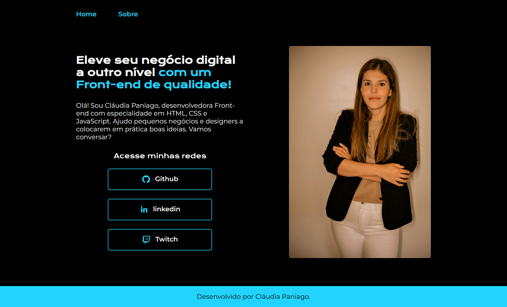
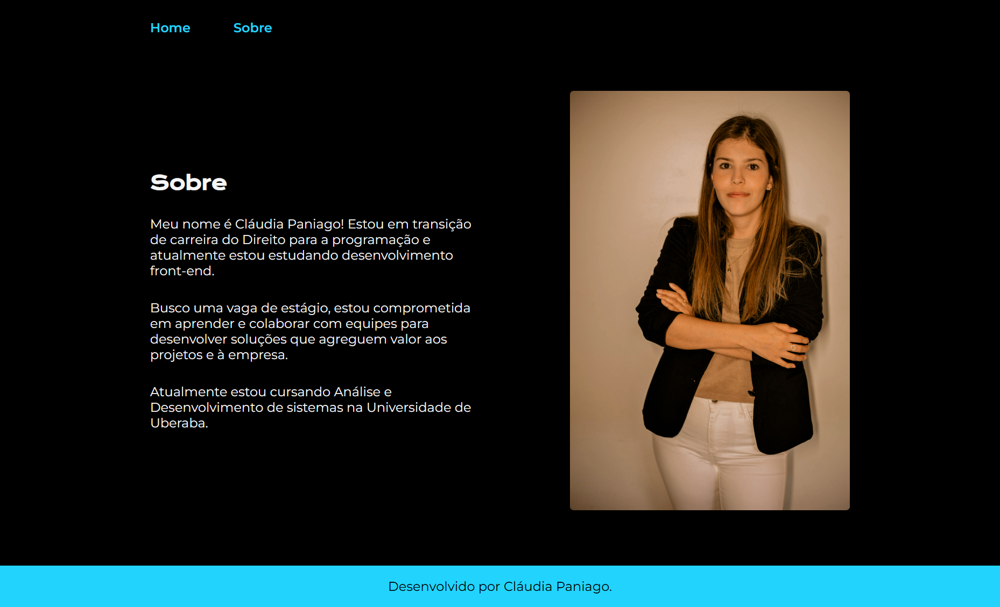

## Portfólio Alura

Desenvolvi uma  página de portfólio durante o curso de HTML E CSS: CABEÇALHO, FOOTER
E VARIÁVEIS CSS da Alura em parceria com a ONE da Oracle Next Education.

## Tecnologias Utilizadas

- HTML5
- CSS3

## ❤️ Contato
claudiacostapaniago@gmail.com
